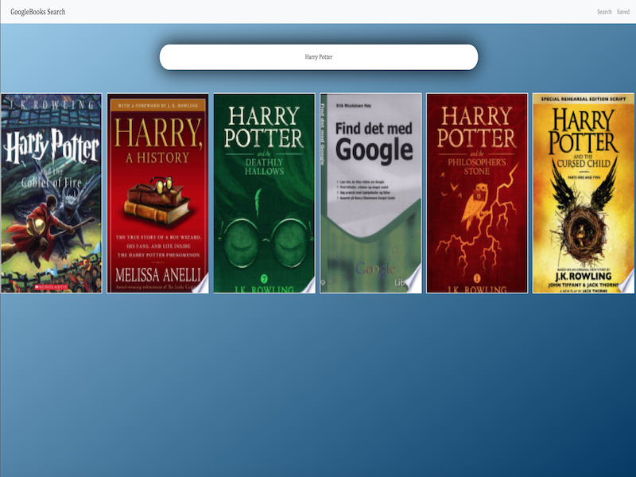

# reactreadinglist-auth
React Reading List App with simple Auth

### sample .env file:
```
APP_SECRET=s0m3s3cr3tk3y*
```
#test here

#circleCI notes
- once our tests are added, need to change line 23 of config.yml to run "start-server-and-test ..." like this "https://docs.cypress.io/guides/guides/continuous-integration.html#Boot-your-server"

### Demo
    
    
    
    Demo link: "https://jdb443-google-book.herokuapp.com/"


### Made Using
    axios
    chai
    connect-mongo
    dotenv
    eslint-config-prettier
    express
    express-session
    if-env
    mocha
    mongoose
    morgan
    passport
    passport-local
    react-router-dom
    reactstrap